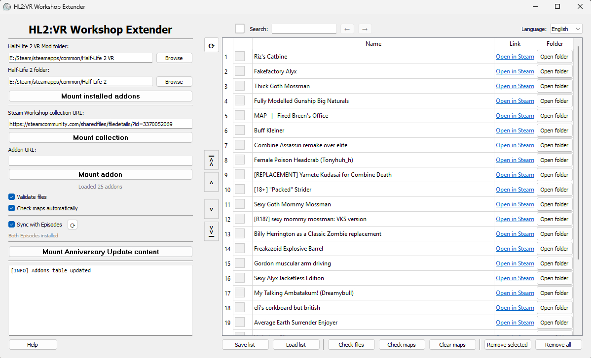

# HL2:VR Workshop Extender

A tool for mounting mods from Half-Life 2 workshop into Half-Life 2: VR Mod.

This project was mostly vibecoded, since I'm not a programming enthusiast, so the code can be messy in places. Still, it took me a month of active work and an actual effort to understand all the caveats and make this a full-fledged tool that serves its purpose as smoothly as possible.



## How It Works

The tool doesn't download anything, but mounts already downloaded Steam addons. This process works as follows:

1. The tool retrieves addon IDs either from their Steam page or from workshop.txt (HL2's addon list file) 
2. Uses these IDs to locate addon files in the Half-Life 2 workshop folder `(*\steamapps\workshop\content\220)`
3. Inserts these paths into Half-Life 2 VR's `gameinfo.txt` file, instructing the game to use this content 

## Main Features

- Mounting installed addons
- Mounting addons from Steam workshop collections  
- Mounting individual addons
- Mounting addons into Episodes
- Managing addon load order
- Verifying addon file existence
- Maintaining map addons functionality
- Saving and loading addon lists
- Installing Anniversary Update content

## Using the Tool

### Basic Usage
1. **Set Paths** - Specify your HL2:VR and Half-Life 2 folder locations
2. **Choose Method**:
   - **Mount Installed** - Use your list of installed addons from HL2
   - **From Collection** - Paste a Steam workshop collection URL
   - **Single Addon** - Paste an individual addon URL
3. **Manage** - Use the interface to reorder, remove, or verify addons

### Map Addons
Due to some caveats with mounting maps, this tool has functionality of detecting and extracting map addons to make them work.

### Anniversary Update
Workshop Extender can also upgrade HL2:VR to the Anniversary Update by modifying some game files.
<br>(The tool has such a big size bacause of AnniversaryContent folder that contains some modified map files for proper functionality)

## Notes
- **Windows Only** - Linux is not supported
- **Languages** - Supports English and Russian language

## More info

For detailed descriptions and troubleshooting, use the "Help" section within the program interface.

### Building from Source

1. **Install dependencies:**
   ```bash
   pip install -r requirements.txt

2. **Build using PyInstaller:**
   ```bash
   pyinstaller --onedir --windowed --name "HL2VR_Workshop_Extender" --add-data "AnniversaryContent;AnniversaryContent" --add-data "icon.ico;." --icon=icon.ico main.py
